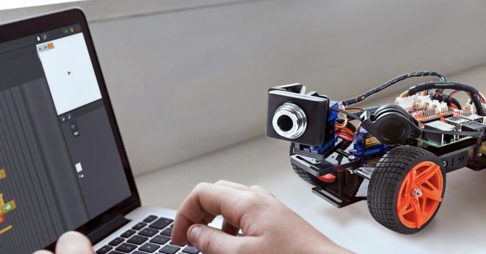
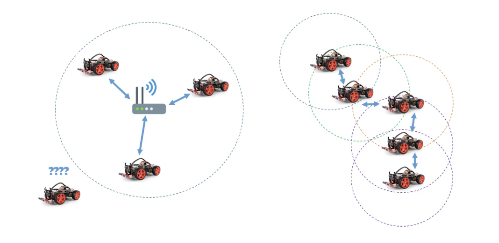
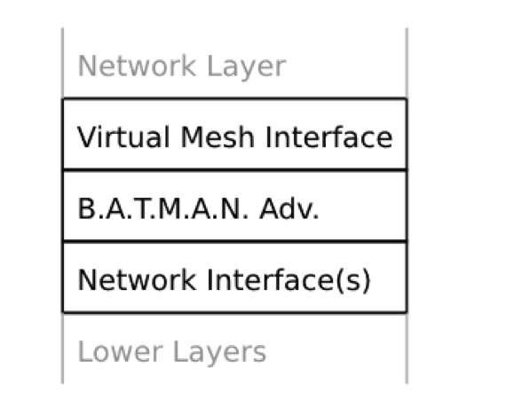
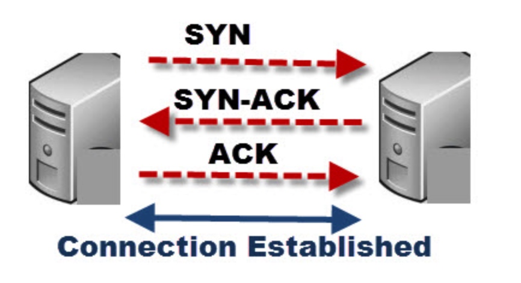

## 页数限制：共30
1. 封面+目录+。。。 6页
2. Introduction 1页
3. background 6页
4. 设计和实验 5页
5. 结果和评估 5页
6. conclusion 2页
7. appendix 2页
8. Bibliography 2页

[TOC]
## 2. Background
### 2.1 Robotics
#### 2.1.1 Multi-Robot Systems 
#### 2.1.2 Raspberry Pi
#### 2.1.3 SunFounder Raspberry Pi Smart Video Car 
### 2.2 Robot software and operating system
#### 2.2.1 ROS
#### 2.2.2 ROS2
#### 2.2.3 Ubuntu
### 2.3 ROS Commnucation
#### 2.3.1 Star Network Topology 
#### 2.3.2 TCP and UDP

### 3.1 Ubuntu and ROS system installation
### 3.2 ROS2 installation
### 3.3 ROS2 installation

## 2. background
### 2.1 Robotics
Robotics is a branch of engineering that involves the conception, design, manufacture, and operation of robots[24]. Robots are machines that can be used to do jobs. Some robots can do work by themselves. Other robots must always have a person telling them what to do. Today’s robotic systems generally consist of many small autonomous systems working together to form a coherent whole[25].

#### 2.1.2 Multi-Robot Systems

Given the rate of technological advancements over the past decade or so, the adoption of robotics has become increasingly widespread. In most domains, the performance of multiple robots outperforms a single robot, both with respect to cost, efficacy and domain potential [14]. This has led to multirobot systems becoming a key area of research within the field of robotics in general [15].

Multi-robot systems can consist of many intelligent agents (each of which may be comprised of many small autonomous systems) working to solve a task that any one system may not be able to solve alone. These multirobot are distinct from a multi-agent system in which individual nodes are generally stationary, as each agent in a multi-robot system is mobile[16]. Mobile robotics has been made more possible recently by advances in battery and wireless communication technologies[17]. 

#### 2.1.1 ROS and ROS2

Robotic middleware is a software infrastructure that is intended to provide convenient abstraction and communication paradigms for facilitating this multi-subsystem approach. In general, a robotics middleware would provide a common interface design so that no matter what hardware is producing the data, the results are distributed in a consistent manner[18].

Robot Operating System (ROS or ros) is robotics middleware (i.e. collection of software frameworks for robot software development). ROS is not an operating system. It is a set of software libraries and tools that help people build robot applications. From drivers to state-of-the-art algorithms, and with powerful developer tools and it’s all open source[12]. ROS is a software framework meant to allow people to write applications which operate robotic hardware. As its most fundamental level, it is an abstraction layer - offering hardware abstraction.  

Robot Operating System is mainly composed of 2 things[13]:
1) A core (middleware) with communication tools.
2) A set of plug and play libraries.

ROS2, which is a new version of ROS that is under heavy development. Since ROS was started in 2007, a lot has changed in the robotics and ROS community. The goal of the ROS2 project is to adapt to these changes, leveraging what is great about ROS and improving what is not[26]. 

ROS1 uses a custom serialization format, a custom transport protocol as well as a custom central discovery mechanism. ROS2 has an abstract middleware interface, through which serialization, transport, and discovery is being provided. Currently all implementations of this interface are based on the DDS standard[27]. This enables ROS2 to provide various Quality of Service policies which improve communication over different networks. ROS1 is targeting Python 2. ROS2 requires at least Python version 3.5.

### 2.2 Pi Car S Robots
The following sections introduce the hardware and operating system that used in this project. Pi Car S Robots is a car robot based on Raspberry Pi. It uses Raspbian based on Linux as operating system. 

**2.1.1 Raspberry Pi**
The Raspberry Pi is a series of small single-board computers developed in the United Kingdom by the Raspberry Pi Foundation to promote teaching of basic computer science in schools and in developing countries.[1]

The Raspberry Pi is small sized like credit card, single board computer. It’s capable of doing everything that a desktop computer can do, from browsing the internet and installing applications, even playing games. It runs Linux and other available operating systems from a micro SD card. With the addition of a keyboard, mouse and micro USB power supply it can be connected to a television or monitor and used as a fully functioning desktop computer. In short, the Raspberry Pi is a small computer with relatively limited memory and performance, but it contains all needed functions.

The first Raspberry Pi was released in 2012, since then it has been used in a vast range of projects due to its low cost, portability, programmability and both wired and wireless connectivity[8]. Several generations of Raspberry Pis have been released. The Raspberry Pi 3 and Pi Zero W (wireless) are equipped with 2.4 GHz WiFi 802.11n (150 Mbit/s) and Bluetooth 4.1 (24 Mbit/s) based on the Broadcom BCM43438 FullMAC chip with no official support for monitor mode. The Raspberry Pi 3B+ features dual-band IEEE 802.11b/g/n/ac WiFi, Bluetooth 4.2, and Gigabit Ethernet[2].

**2.1.2 Raspbian**
Raspbian is an Linux based operating system which is free to download and use based on Debian optimized for the Raspberry Pi hardware. The Raspberry Pi can run different operating systems, they include: Windows 10 Arch Linux, Ubuntu and others. Raspbian is the most popular operating system for normal use on a Raspberry Pi and is also Sun Founders recommended OS for use with the Pi Car S robots used in this project. 

Debian has millions of users, excellent documentation and many online knowledge bases, as such it is easy to find solutions to a vast range of issues. Debian uses the apt and dpkg tools for software package and dependency management to install software from Debian's free online repository of over 37,000 pre-compiled software packages[4].

Raspbian was created by Mike Thompson and Peter Green as an independent project[3]. The operating system is still under active development. Raspbian is specifically optimized for the Raspberry Pi line's low-performance ARM CPUs due to the low-performance hardware[9]. 

Being a linux computer, Raspbian supports basically many kinds of programming languages, mainly language like Python, Java, C/C++ etc. User just need to install the support if it's not installed. It is composed of a modified LXDE desktop environment and the Openbox stacking window manager with a new theme and few other changes[10]. Therefor, it is easy for user to interact. 

**2.1.3 SunFounder Raspberry Pi Smart Video Car**

SunFounder is a technology company focused on Raspberry Pi and Arduino open source
community development. The Pi Car-S Robot is a smart car which work based on a Raspberry Pi.

The raspberry pi car comes with three sensor modules including ultrasonic obstacle avoidance, light follower, and line follower. The car robot has durable and shatterproof plate and new style Servo, the MAX torque of the clutch gear digital servo is up to 1.6KG[11]. It rotates from 0-180 degrees.

Python code is provided for the car, and users can also program and debug it with Dragit, a Snap-based graphical interface, by just simple dragging and dropping the code blocks for more complex functions. A user can learn the programming conveniently on how to control the car.

### 2.3 Network Communication

Raspberry Pi can use Ethernet, Bluetooth and wifi to communicate with other devices or network. The following section will provide some background on networking protocols and topologies suitable for this project.

**Star Network Topology**

A star topology is a network that has a central intermediate device. It is the most common WLAN topology in real life, as it is easy to install, scalable and easy to troubleshoot[21]. At the centre of the network sits the multifunctional wireless router providing the functionality of a wireless access point (WAP), a modem, a switch and a router.

Infrastructure wireless means having a device (access point) that gives structure to the network--in particular it will usually include a DHCP server, allocating IP address dynamically to every access devices. Using a wireless router is preferable because the networks are easier to set up and maintain, better security (WPA2 and WPA-PSK) is available, ethernet connected devices can be easily added, and internet access is much easier and better. However, a P2P wireless solution is necessary to allow free movement of the robots.

**P2P Technology**
A P2P network consists of 2 or more end devices connected to form a network. A P2P network differs from a Star network in that it does not require a central network device such as a WAP, this style of network is also known as ad-hoc[7]. 

An ad hoc network is a type of temporary computer-to-computer connection. In ad-hoc mode, you can set up a wireless connection directly to another computer without having to connect to a Wi-Fi access point.Ad-hoc wireless is nice because no additional equipment is needed. 

Peer to peer means all the computers are "equal". Almost all home networks are peer to peer, although many people think of one of the computers as being "main" or the "file server."

**Mesh Network Topology**

A mesh topology consists of multiple P2P connections. They can be either full, where every station can communicate directly with one another, or partial where not all the stations can communicate directly. This is a critical enabling feature in dynamic distributed robotics and IoT networks to overcome range issues associated with using low power transmissions.

Mesh network setup where each computer and network device is interconnected with one another, allowing for most transmissions to be distributed even if one of the connections go down[22]. Therefore, this network that has multiple routes to a destination is also more resilient as it provides redundancy should one link fail or become congested. It is a topology commonly used for wireless networks.

**B.A.T.M.A.N Adv Protocal**

The Open Mesh project manages the Better Approach to Mobile Ad-hoc Networking Advanced (B.A.T.M.A.N Adv) open source routing protocol[23]. It’s a multi-hop, ad-hoc mesh networking protocol that operates at layer 2 of the OSI model. It is integrated as a layer between the network interface drivers and a virtual interface created by the protocol which can be bridged with 802.11, Ethernet and Bluetooth physical interfaces.

In early 2007, the B.A.T.M.A.N. developers started experimenting with the idea of routing on layer 2 (Ethernet layer) instead of layer 3. To differentiate from the layer 3 routing daemon, the suffix "adv" (for: advanced) was chosen. Instead of manipulating routing tables based on information exchanged via UDP/IP, it provides a virtual network interface and transparently transports Ethernet packets on its own.[5] The batman-adv kernel module has been part of the official Linux kernel since 2.6.38.[6]

**2.3.2 TCP vs UDP**

Both TCP and UDP work on top of the IP (Internet Protocol). This is why there are terms such as TCP/IP or UDP/IP. In the OSI model, TCP and UDP are both "Transport Layer" Protocols[19]. Where TCP is a connection oriented protocol and UDP is a connectionless protocol. 

TCP and UDP are network protocols that are used to send data packets. These data packets are just bits of data that travel over the internet. When a user chat with his friends online, send an email, or send a page request through browser, he sends online data. This data is transferred in the form of tiny packets. While TCP and UDP are the most commonly used protocols, they aren’t the only ones used to transfer data packets. Another protocol that can be used is ICMP (Internet Control Message Protocol). However, most connections rely on either TCP or UDP.

There are three main differences between TCP and UDP[20]:

1. Reliability
TCP is more reliable since it manages message acknowledgment and retransmissions in case of lost parts. Thus there is absolutely no missing data. UDP does not ensure that communication has reached receiver since concepts of acknowledgment, time out and retransmission are not present.

2. Ordering
TCP transmissions are sent in a sequence and they are received in the same sequence. In the event of data segments arriving in wrong order, TCP reorders and delivers application. In the case of UDP, sent message sequence may not be maintained when it reaches receiving application. There is no way of predicting the order in which message will be received.

3. Connection
TCP is a heavy weight connection requiring three packets for a socket connection and handles congestion control and reliability. UDP is a lightweight transport layer designed atop an IP. There are no tracking connections or ordering of messages.

TCP 3 handshake

[1] Cellan-Jones, Rory (5 May 2011). "A£15 computer to inspire young programmers". BBC News.

[2]  "seemoo-lab/nexmon". GitHub.

[3] "RaspbianAbout - Raspbian". \url{www.raspbian.org}. Retrieved 2016-06-05.

[4] "Debian". \url{https://www.computerhope.com/jargon/d/debian.htm}

[5] "batman-adv — The Linux Kernel documentation". \url{www.kernel.org}. Retrieved 2019-04-14.

[6] "Linux 2 6 38". Linux Kernel Newbies.

[7] "P2P netwokr". Dye et all 2008.

[8] "Zero WH: Pre-soldered headers and what to do with them". Raspberry Pi Foundation. Retrieved 12 January 2018.

[9] "FrontPage - Raspbian". \url{www.raspbian.org}. Retrieved 2016-04-04.

[10] "Introducing PIXEL - Raspberry Pi". Raspberry Pi. 2016-09-28. Retrieved 2017-01-07.

[11] "SunFounder PiCar-S Kit V2.0". \url{https://www.sunfounder.com/picar-s-kit.html}.

[12] "ROS Melodic Morenia". wiki.ros.org. Retrieved 10 June 2018.

[13] "The Robotics Back-End". \url{https://roboticsbackend.com/what-is-ros}.

[14] Avinash Gautam and Sudeept Mohan. A review of research in multi-robot systems. In 2012 IEEE 7th International Conference on Industrial and Information Systems (ICIIS), pages 1–5. IEEE, Aug 2012.

[15] Pedro U. Lima and Luis M. Cust´odio. Multi-Robot Systems. In Innovations in Robot Mobility and Control, pages 1–64. Springer, Berlin, Heidelberg, Aug 2005.

[16] Zhi Yan, Nicolas Jouandeau, and Arab Ali Cherif. International Journal of Advanced Robotic Systems, 10(12):399, 2013.

[17] Deborah Estrin, David Culler, Kris Pister, and Gaurav Sukhatme. Connecting the physical world with pervasive networks. IEEE pervasive computing, 1(1):62–63, 2002.

[18] "Robotic Middleware" Isaac Jordan. Experiment 1 - No Disk Writing Code. \url{https://github.com/Sheepzez/ros-multirobot-evaluation/tree/master/experiments/message_latency/no_ echo_delay_no_disk_write}. Accessed: 2017-03-18.

[19] "Communication Networks/TCP and UDP Protocols". \url{https://en.wikibooks.org/wiki/Communication_Networks/TCP_and_UDP_Protocols}.

[20] "What’s the Difference Between TCP and UDP?". \url{https://www.howtogeek.com/190014/htg-explains-what-is-the-difference-between-tcp-and-udp/}.

[21] "Star topology". Cisco Networking Academy 2014.

[22] "Mesh topology". \url{https://www.computerhope.com/jargon/m/mesh.htm}.

[23] "Open Mesh". \url{https://www.openmesh.com/datto-networking}.

[24]"What Is Robotics?" \url{https://www.nasa.gov/audience/forstudents/k-4/stories/nasa-knows/what_is_robotics_k4.html}. Nov. 9, 2009

[25] B. Bauml and G. Hirzinger. Agile Robot Development (aRD): A Pragmatic Approach to Robotic Software. In 2006 IEEE/RSJ International Conference on Intelligent Robots and Systems, pages 3741–3748, Oct 2006.

[26] "Why ROS 2?".  \url{https://index.ros.org/doc/ros2/}

[27] "Changes between ROS 1 and ROS 2". \url{http://design.ros2.org/articles/changes.html}.