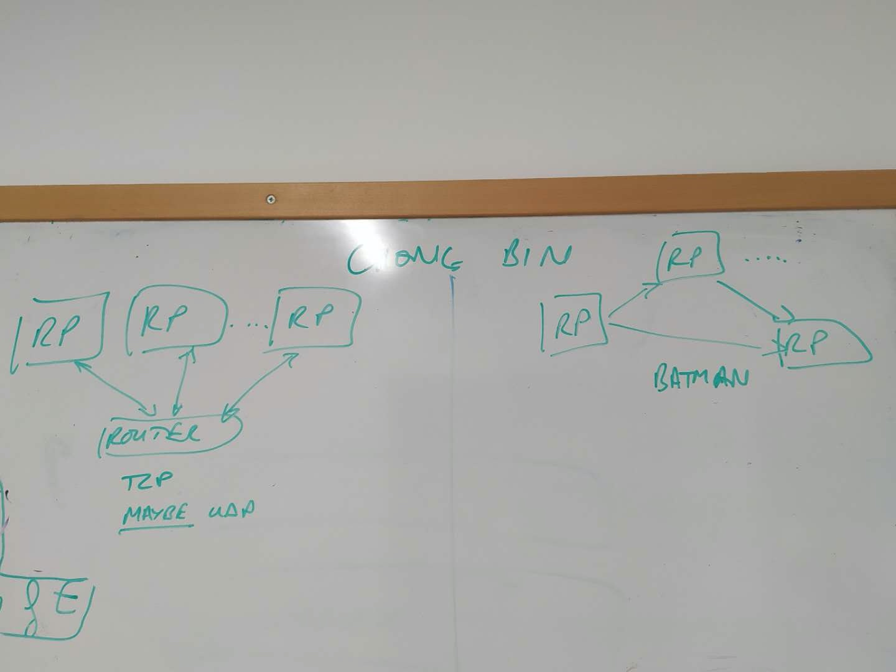
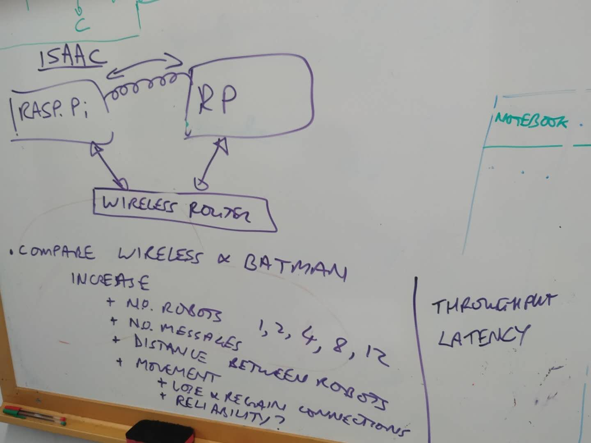

## week 1 (6.13-6.19)
### finished tasks
1. reading all the details of three report. I know exactly what they do :
2. Jamie's report 报告主要讲了如何配置batman网络，并在开机的时候开启服务。然后使用命令行或者wireshark等工具来对网络进行测试。

### Q&A

1. what is my exact object?
2. rasperay pi是什么系统
3. router是什么。特定的router，发给我们
4. 我做过一些tcp和udp socket编程用java，但是和本项目有什么关联吗？可以
5. 我主要要测量什么数据。延迟，吞吐量throughput

### 时间节点
先比较tcp 在Router和batman然后如果有时间做udp
background给phil trinder 6.30之前
6.30-8.8 做实验
8.8-9.6 写报告

### 规划
首先实现isaac router 可以使用它的代码
然后实现batman，使用jamie做的代码

1. introduction
2. Background
3. experiment design and implementation
4. result and analysis
5. conclusion

1. 实现多个pi连接router（默认）然后使用tcp（默认）来测试下图中的一些指标
2. 使用p2p网络batman来连接pi，然后使用tcp（默认）来测试下图中的一些指标
3. 如果完成了，可以改用udp来测试指标参数

测试robot数量
测试消息传送成功率，比如发送100条，有多少丢失（首先使用简单消息，然后使用真实数据传输。）
距离的影响
移动的影响，是否会丢失连接

测试吞吐量和延迟
## week 2 (6.20-6.28)
### done
- 完成报告background的草稿

## week 3（6.29-7.4）
同一个网络连接问题，所有板子需要在同一个局域网下。如何解决，是否提供路由器？
需要更多usb hub
我认为introduction 应该做完再写
### TODO
- reading issac report carefully
- install ROS 
- send message via ROS
- 配置开机自动连接wifi
- 学习使用wireshark分析网络配置

### done
- change **background** structure change and add robotics + ROS2
- installed ros for all pi 
- timetable details

## week 4（7.8-7.14）
June 11 at 11.30am (Zoom, Natalia)

### TODO

### done
- install ROS on ubuntu successfully and networkconfiguration.
- learn ros, many things many configuration
- send and receive message via ROS ,然后是自定义（custom）信息 many missing steps and some wrong instruction

## week 5

### TODO
- record configuration issue with ROS communicating(all question is in project steps file)
- dissertation

### Done
- upload code into bitbucket and github
- timetable design
- project steps detailes include issues
- run the experiment 1 and 4 and collect data then plot the data and compare with issac experiment
- experitment 1 finished

## week 6
June 24 at 2pm (Phil's office）

#### Reproduce jamie experiment
I tried it for 3 whole days and in different ways and lost much hairs:
1. Firstly, I tried configure BATMAN on ubuntu but failed and p2p ad-hoc network it is also not successful, there few things about ad-hoc installation.
2. Then I tried to configure it on Raspbian as Jamie's instruction, information shows no errors but when I check it, not installed succesfully again.
    different software, raspbian stretch and buster
    different hardware, pi 3B and 3B+
    I consulted Jamie and talked deeply, but usb toggle to increase MTU and I don't have it but I changed some argument he said, but failed again
    
3. I think the 3B+ dose not support p2p network or something there are few information about it on the internet. 

And now on latest Raspbian system cannot install ROS Jamie also did the same work but failed because some outdate dependency. So I have to use Ubuntu but I tried many times and many ways, and failed. 

So I think I should focus on UDP transport and time are limited next week I will try to use UDP and then do the mutiple robots experiments and collect data and analyze data so time is not enough.

### Done
- reproduce and modify experiment 1 compare my experiment with Issac and add the report on dissertation
- installation write on disseration
- submit it on github

## week 7
### DONE
install ROS2
communication between ROS2
modify background

### TODO
write own code communication between ROS2
write data handle code 