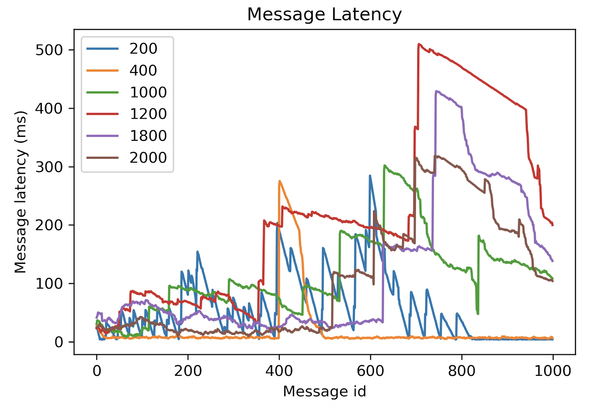

# Experiment 1: Revising wifi router performance experiment

## Objective
This experiment investigates the performance in different frequency of message passing by using Wi-Fi network connection in a router.  This experiment was executed by Issac in the previous and my aim is execute this experiment to compare it with the Issac's one.

## Rationale
In order to acquire a detailed understanding of the performance characteristics of ROS’ communication channels, this experiment use two ROS hosts to commnunicate with each other and get the message latency results in different frequency. To understand project and make further project, I reproduced Issac's experiment to see what is the difference and and get result which is a bit different with him. This experiment provides familiarity with ROS and grasp an understanding of how ROS communication works.
why do you want to reproduce.
## Procedure
1. Install ROS and ubuntu in Raspberry Pi
2. Sending message and receive message between two hosts.
3. Sending 10HZ message and test message latency.
4. Run the code which send timestamped messages from the sender host to the echoer host, which will send it back to the sender. The sender then records the message ID and sent and received times to file. The code is run 3 times with a range of message frequencies from 200Hz to 2000Hz in 200Hz steps (200Hz, 400Hz, ..., 1800Hz, 2000Hz) to obtain averaged results for each message frequency.

## Hardware Configuration
Raspberry Pi 3B
A router
A control computer

## Software Configuration
Ubuntu
ROS Kinetic 
network configuration for all LAN devices

## Hypothesis
1. The latency should be not regular(explain) due to the wifi connection is not stable. 
2. The low frequency should show different performance with high frequency.(how and why)
3. different version
 
## Results and Discussion
The data which I collect and plot is as follows:

The message latency is not regular and low frequency can perform relatively lower latency. Wifi connection can be different in different time so that is why the fluctuation is obvious.

The previous experiment by Issac shows lower latency and I think that is due to his router is different and more stable or some other environment factors.
However the result is with expectiation.

including 1 10 hz
使用Issac的图对比说明
## Conclusion