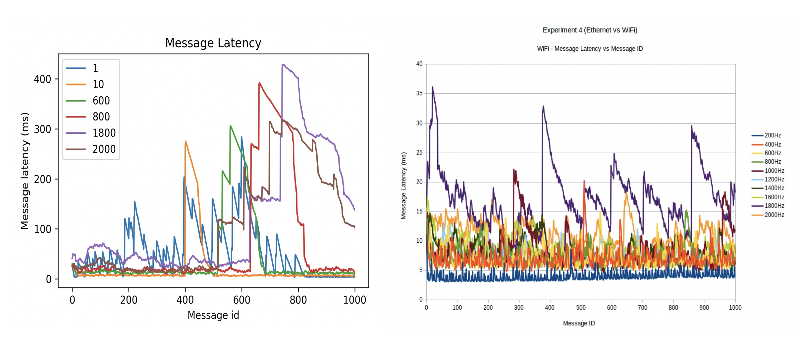

# Experiment 1: Revising wifi router performance experiment

## Objective
This experiment investigates the performance in different frequency of message passing by using Wi-Fi network connection in a router.  This experiment was executed by Issac in the previous and my aim is execute this experiment to compare it with the previous one.

## Rationale
In order to acquire a detailed understanding of the performance characteristics of ROS’ communication channels, this experiment use two ROS hosts to commnunicate with each other and get the message latency results in different message frequency. I reproduced Issac's experiment to see what is the difference between my experiment and the previous one then analyze the reason to cause these differences.

## Procedure
1. Install ROS and ubuntu in Raspberry Pi 3B+
2. Sending message and receive message between two hosts to test communication.
3. Sending 10HZ message and test message latency.
4. Run the code which send timestamped messages from the sender host to the echoer host. The sender will receive the message and then record message id into a file. The code is run 3 times with a range of message frequencies from 1hz to 2000Hz to obtain averaged results for each message frequency.

## Hardware Configuration
2 Raspberry Pi 3B+
TP-Link 150M router

## Software Configuration
Ubuntu 16.04
ROS Kinetic 

## Hypothesis
1. The latency should be not regular(explain) due to the wifi connection is not stable. 
2. Different message frequency may perform different latency due to the wifi environment.
 
## Results
The data which I collect and plot is as follows, the left one is mine and the right one is Issac's experiment graph.

## Conclusion
The previous experiment by Issac shows lower latency and I think that is due to the different hardware and some other environment factors.

The message latency is not regular and different frequency can perform relatively different latency. Wifi connection can be different in different time so that is why the latency is obvious in specific time period.

