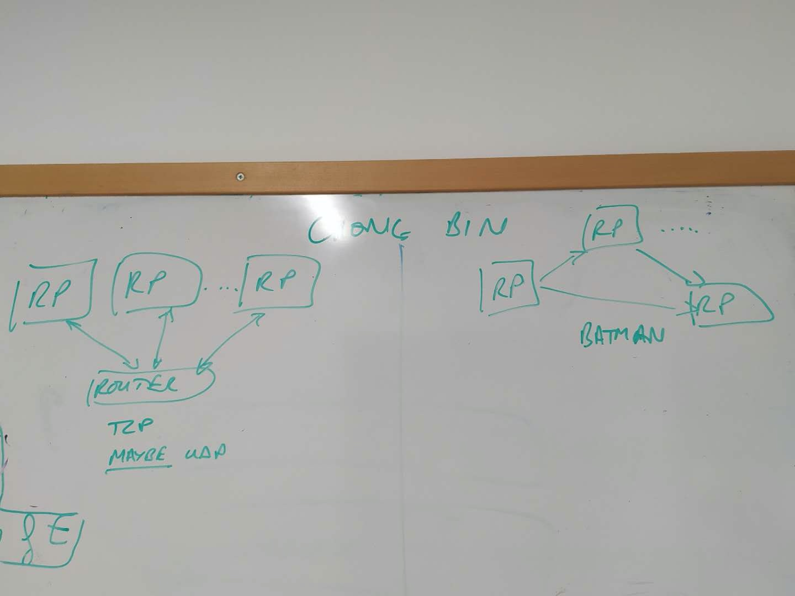

## week 1 (6.13-6.19)
### finished tasks
1. reading all the details of three report. I know exactly what they do :
2. Jamie's report 报告主要讲了如何配置batman网络，并在开机的时候开启服务。然后使用命令行或者wireshark等工具来对网络进行测试。

### Q&A

1. what is my exact object?
2. rasperay pi是什么系统
3. router是什么。特定的router，发给我们
4. 我做过一些tcp和udp socket编程用java，但是和本项目有什么关联吗？可以
5. 我主要要测量什么数据。延迟，吞吐量throughput

### 时间节点
先比较tcp 在Router和batman然后如果有时间做udp
background给phil trinder 6.30之前
6.30-8.8 做实验
8.8-9.6 写报告

### 规划
首先实现isaac router 可以使用它的代码
然后实现batman，使用jamie做的代码

1. introduction
2. Background
3. experiment design and implementation
4. result and analysis
5. conclusion

1. 实现多个pi连接router（默认）然后使用tcp（默认）来测试下图中的一些指标
2. 使用p2p网络batman来连接pi，然后使用tcp（默认）来测试下图中的一些指标
3. 如果完成了，可以改用udp来测试指标参数

测试robot数量
测试消息传送成功率，比如发送100条，有多少丢失（首先使用简单消息，然后使用真实数据传输。）
距离的影响
移动的影响，是否会丢失连接

测试吞吐量和延迟
## week 2 (6.20-6.28)
### done
- 完成报告background的草稿

## week 3（6.29-7.4）
同一个网络连接问题，所有板子需要在同一个局域网下。如何解决，是否提供路由器？
需要更多usb hub
我认为introduction 应该做完再写
### TODO
- reading issac report carefully
- install ROS 
- send message via ROS
- 配置开机自动连接wifi
- 学习使用wireshark分析网络配置

### done
- change **background** structure change and add robotics + ROS2
- installed ros for all pi 
- timetable details

## week 4（7.8-7.14）
June 11 at 11.30am (Zoom, Natalia)

### TODO

### done
- install ROS on ubuntu successfully and networkconfiguration.
- learn ros, many things many configuration
- send and receive message via ROS ,然后是自定义（custom）信息 many missing steps and some wrong instruction
- 知道了整个系统如何运行的。

## week 5

### TODO
- 创建github
- 写时间表
- 添加文档并记录实验安装和配置，并记录installation and configuration英文版(1天）
- experitment记录和设计（1天）
- 继续看issac文档，完成experiment 7（2天）
- change **background** 
- 学习使用wireshark分析网络配置

## week 6
June 18 at 11.30am (Zoom, Natalia)
June 24 at 2pm (Phil's office