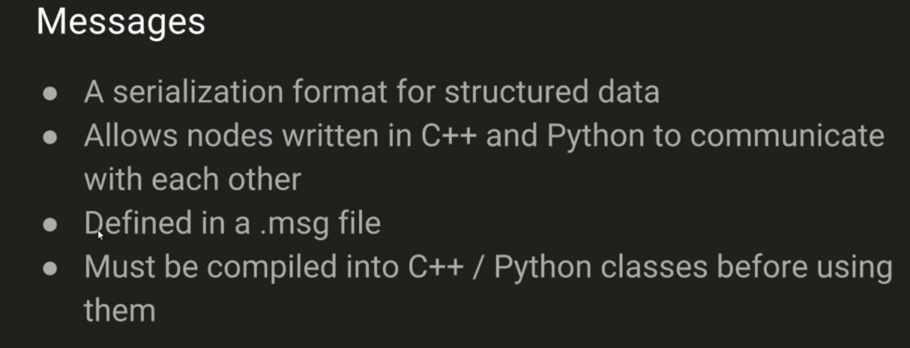

[TOC]
## 学习
### 背景知识
#### Sun founder Pi Car S robots
是一个可以用python编程的robot，并可以拖放，基于图形界面。
包括三个感应模块：超声波传感器，线追踪传感器，光追踪传感器
转向通过servo电机实现，和两个小的电动马达来驱动轮子。
#### Raspberry Pi 树莓派
Pi是指python因为python是上第一个应用程序。所以该项目基于python。
一句话：树莓派是一个卡片大小的开发板，上面可以运行 Linux 系统，我们可以用它开发我想要的设备。
单片机，信用卡大小，用作教学。。 它可以运行Linux和其他免费提供的操作系统。类似于电脑主机。
他有ethernet接口，无线网卡，和蓝牙片，所以允许多种网络接入。
#### Raspbian
树莓派的操作系统。
基于Linux，是Pi Car S所使用的操作系统，在机器人车上最流行的系统。
他是基于Debian的一个非官方操作系统。
#### 2.5 自动配置工具
使用自定义脚本来写自动配置，只要开机就会走动运行，使用python编写使网络配置自动化。
编写python程序，启动batman进程。
配置网络需要手动输入，但是我们可以把它写到python中然后自动执行。
### Abstract
该项目的目的是加速网络配置阶段让用户能够直接使用robot car进行工作。By simplifying and speeding up the network configuration phase the end users can get straight down to business.

autonomous设备是这个Sun Founder Pi Car S robots，每一个车有个containing a Linux based Raspberry Pi.
解决方案包括：创建新的系统服务，python和bash脚本，和BATMAN layer 2协议。

The result is a scalable and robust networking solution providing a fully converged ad-hoc mesh network in under 25 seconds.结果是可扩展且强大的网络解决方案，可在25秒内提供完全融合的ad-hoc网状网络。


### background
Pi car S包括sensors, actuators 基于Raspberry Pi Model 3 B版子构建
P2P的解决方案应该允许机器人的移动。
WLAN是无线局域网
WPAN是无线个人网络
LP-WLAN是可靠的数据传输，极低的成本和合理的电池寿命。

三种网络拓扑：
star: 有中心router，给不同的设备自动分配IP
p2p full mesh ： 
p2p partial mesh

P2P网络不需要WAP中心网络设备。比如蓝牙，但是蓝牙只能是两个设备直连，而不适合本项目。
IoT物联网提供传感和追踪
Robotics机器人专注于行动和自主行为。

传统的路由协议通常不适合无线网的P2P网络。
有两种基于802.11标准的协议被认为是最适合提供多跳技术的。Babel和BATMAN
BATMAN已经成为Linux内核中Layer2的一部分。
### ros学习
node 每个控制器的独立单元
publish-发送
sbuscribe接收
topic 通道channel



`rospack find roscpp`定位文件夹路径
`roscd roscpp` 进入某个文件夹下，类似于cd， 只不过多了个ros
`roscd log` 进入日志目录下
`cd ~/catkin_ws/src` 进入工作空间src目录


`catkin_create_pkg beginner_tutorials std_msgs rospy roscpp` 创建一个包，名字为beginner_tutorials，依赖std_msgs rospy roscpp这三个包`# catkin_create_pkg <package_name> [depend1] [depend2] [depend3]`

单独host多个node通信，一个发送一个接收可参考：http://wiki.ros.org/ROS/Tutorials/WritingPublisherSubscriber%28python%29

关闭roscore
killall -9 roscore
killall -9 rosmaster
查看rosnode运行状态
rosnode list


## 实验过程
### raspbian
raspbian buster安装成功
但是ROS安装时与raspbian不兼容，报错，无法安装成功
### ubuntu
安装ubuntu集成ROS版本
https://downloads.ubiquityrobotics.com/pi.html
检查系统版本
`lsb_release -a`

安装成功登录名和密码均为`ubuntu`

### 配置网络连接多个pi：
每个pi连接到路由器
配置开机自动连接到该wifi，这样就可以直接远程ssh连接了。
在路由器配置中将每个pi分配静态ip以便于记住。

使用路由器，让多个pi连接到一个网络，并且给每个pi配置静态ip地址，下次连接就固定使用该ip。
我把Pi都分配固定ip从192.168.1.11-192.168.1.23 一共十二个ip地址给12 个Pi

配置好ip后就可以使用ssh连接到Pi
`ssh ubuntu@192.168.1.11` 
with a password of `ubuntu`


#### 给ubuntu系统安装远程桌面（可选）
`sudo apt update`
`sudo apt upgrade`
`sudo apt-get install tightvncserver`
`sudo tightvncserver`

### 使用ROS系统
因为该系统已经集成好ROS系统，且默认开启

打印ros版本和服务信息
`printenv | grep ROS`

```
ROS_ROOT=/opt/ros/kinetic/share/ros
ROS_PACKAGE_PATH=/home/ubuntu/catkin_ws/src:/opt/ros/kinetic/share
ROS_MASTER_URI=http://ubiquityrobot.local:11311
ROS_VERSION=1
ROS_PARALLEL_JOBS=-j2
ROS_HOSTNAME=ubiquityrobot.local
ROSLISP_PACKAGE_DIRECTORIES=/home/ubuntu/catkin_ws/devel/share/common-lisp
ROS_DISTRO=kinetic
ROS_ETC_DIR=/opt/ros/kinetic/etc/ros
```

### 不同host之间通信

进入不同的host，然后每个host上都要配置文件，配置IP对应主机名称：
`sudo vim /etc/hosts`
 /etc/hosts file of your machine. Example hosts file:

	::1     ip6-localhost ip6-loopback
	fe00::0 ip6-localnet
	ff00::0 ip6-mcastprefix
	ff02::1 ip6-allnodes
	ff02::2 ip6-allrouters

	192.168.1.11 com1
	192.168.1.12 com2

#### 检测通信网络状态
在每个ubuntu系统上再次ssh进入ROS系统

`ssh com1 `
测试ping 1和2
`ping com1`
`ping com2`

在com2上
`ssh com2`
测试ping 1和2
`ping com1`
`ping com2`
完成ping测试

**聊天测试**
主机1 上
`netcat -l 1234`
主机2上
`netcat com1 1234`
聊天，检测通信
成功则继续下一步

#### Start the listener开启接收端

设置ros本机名称(**如不设置，则会找不到主机，则发送不能被接收到。**）
`export ROS_HOSTNAME=com1`
`echo $ROS_HOSTNAME`
设置ros主机对应IP名称
`export ROS_IP=192.168.1.11`
`echo $ROS_IP`
设置主节点master的uri
`export ROS_MASTER_URI=http://com1:11311/`
`echo $ROS_MASTER_URI`

**可以设置为自定义配置**
`cd ~/catkin_ws` 进入工作区目录
`touch config_ip.sh`
`vim config_ip.sh` 创建文件进行配置

```
# /bin/sh
export ROS_HOSTNAME=com1
export ROS_IP=192.168.1.11
export ROS_MASTER_URI=http://com1:11311/
```

`source config_ip.sh` 以后每次执行该文件就可以完成ip和hostname都配置了

然后运行
确保catkin source
`cd ~/catkin_ws`
`source ./devel/setup.bash`
`rosrun rospy_tutorials listener.py`

#### start talker

**每次都配置：**
设置本机名称：自己的主机
`export ROS_HOSTNAME=com2`
`echo $ROS_HOSTNAME`
设置ros主机对应IP名称
`export ROS_IP=192.168.1.12`
`echo $ROS_IP`
设置主节点master的uri（同listener）
`export ROS_MASTER_URI=http://com1:11311/`
`echo $ROS_MASTER_URI`


然后运行
确保catkin source
`cd ~/catkin_ws`
`source ./devel/setup.bash`
`rosrun rospy_tutorials talker.py`

成功Listener会接受到talker传来的信息。该步骤用于测试，是否能够发送和接收成功。成功则进入下一步。


### 发送和接收自定义消息
http://wiki.ros.org/ROS/Tutorials/CreatingMsgAndSrv#Creating_a_msg
#### 创建工作区
`cd ~/catkin_ws/src`
`catkin_create_pkg begin_test std_msgs rospy roscpp`
名字为begin_test， 依赖后面三个包

#### copy文件在ssh和本地之间
**注意这时要开启的是本台电脑的terminal进行copy，而不是已经远程登录的ssh的terminal**

1. 比如要把当前一个文件copy到远程另外一台主机上，可以如下命令。前面为源，后面为目的
`scp /Users/chongbin/Desktop/chongbin_master_project/code/talker.py ubuntu@192.168.1.12:/home/ubuntu/catkin_ws/src/begin_test/src`
2. 把文件从远程主机copy到当前系统，也很简单。
`scp ubuntu@192.168.1.12:/home/ubuntu/catkin_ws/src/beginner_tutorials/scripts/talker.py /Users/chongbin/Desktop/chongbin_master_project/code` 
 
**copy 文件加 -r** 

1. 本地到远程
`scp -r /Users/chongbin/Desktop/chongbin_master_project/code/rosberry_experiments ubuntu@192.168.1.12:/home/ubuntu/catkin_ws/src`
1. 远程到本地
`scp -r ubuntu@192.168.1.11:/home/ubuntu/catkin_ws/src/results /Users/chongbin/Desktop/chongbin_master_project/experiments/router_result`

#### 运行工作区下的python文件
当把文件夹拷贝过去之后
要编译安装一下工作区
`cd /home/ubuntu/catkin_ws`
`catkin_make install`

然后进行可执行文件的编译不然无法执行：
`cd /home/ubuntu/catkin_ws/src/rosberry_experiments/src`
`chmod +x test_latency_echo.py`
然后运行监听文件
`rosrun rosberry_experiments test_latency_echo.py 10 1000`

编译然后运行发送文件
`chmod +x test_latency_main.py`
`rosrun rosberry_experiments test_latency_main.py 10 1000`
10表示rate频率，1000表示要发一千条消息。

然后在`rosberry_experiments`文件夹下生成`times_10.txt` 记录文件。可以查看运行结果：
ID(int),SendTime(float),RecvTime(float)


### 运行issac experiment4
当把文件夹拷贝过去之后
要编译安装一下工作区
`cd /home/ubuntu/catkin_ws`
`catkin_make install`
编译可执行文件
`cd /home/ubuntu/catkin_ws/src/rosberry_experiments/src`
`chmod +x test_latency_echo.py`
先在接收端
`rosrun rosberry_experiments test_latency_echo.py`

再在发送端
`cd /home/ubuntu/catkin_ws/src/rosberry_experiments/src`
`chmod +x test_latency_main.py`
运行可执行文件，运行三次并得到结果
`source run_experiment.sh`

运行完结果会存储在reslut文件夹里，运行三次取平均值，有个文件来帮助合并结果。数据结果处理使用python画图。

## 安装Ubuntu + ROS2
#### 安装ubuntu mate系统
因为ROS2只支持64位系统
raspberry Pi 3B+建议使用
https://ubuntu-mate.org/download/
ubuntu Bionic版本

查看系统版本
`lsb_release -a`
查看系统位数
`getconf  LONG_BIT`
配置ssh

**error**
ssh remote host identification has changed

#### 安装ROS 2
官网安装教程安装Debian版本
https://index.ros.org/doc/ros2/Installation/Crystal/Linux-Install-Debians/
建议使用这个，如果使用下载安装包安装则安装不上一些依赖包。
`sudo locale-gen en_US en_US.UTF-8
sudo update-locale LC_ALL=en_US.UTF-8 LANG=en_US.UTF-8
export LANG=en_US.UTF-8`

`sudo apt update && sudo apt install curl gnupg2 lsb-release`
`curl -s https://raw.githubusercontent.com/ros/rosdistro/master/ros.asc | sudo apt-key add -`
install
`export CHOOSE_ROS_DISTRO=crystal`
`sudo apt update`
`sudo apt install ros-$CHOOSE_ROS_DISTRO-ros-base`
Environment setup
`sudo apt install python3-argcomplete`
`source /opt/ros/$CHOOSE_ROS_DISTRO/setup.bash`
`echo "source /opt/ros/$CHOOSE_ROS_DISTRO/setup.bash" >> ~/.bashrc`


### ROS2运行测试
安装build工具
`sudo apt install python3-colcon-common-extensions`
create workspace
`mkdir -p ~/ros2_example_ws/src`
`cd ~/ros2_example_ws`

add code
`sudo apt install git`
`git clone https://github.com/ros2/examples src/examples`
`cd ~/ros2_example_ws/src/examples/`
`git checkout $ROS_DISTRO`
删掉cpp的包，找到rclcpp包删除
`rm -r rclcpp`
build code
`cd ~/ros2_example_ws`
`colcon build --symlink-install`
启动代码：
每次启动terminal都要
`. ~/ros2_example_ws/install/setup.bash`
`ros2 run examples_rclpy_executors talker` 
等待一段时间

#### ROS2通信
因为ROS2是udp广播通信，所以ROS2 的发送会广播发送给同一个网段内的所有机器
在一个机器上先运行listener
`. ~/ros2_example_ws/install/setup.bash`
`ros2 run examples_rclpy_executors listener` 
在另一个同网段机器上运行talker
就可以通信了。
如果listener没接到数据，在同一个机器再开一个talker进行打通。
#### 运行多次实验得到结果
`scp -r comros2@192.168.1.2:/home/comros2/ros2_example_ws/src/examples/rclpy/topics /Users/chongbin/Desktop/chongbin_master_project/experiments/code_ros2`
修改入口代码，setup.py文件
拷贝代码过去
`scp -r /Users/chongbin/Desktop/chongbin_master_project/experiments/code_ros2/minimal_publisher comros1@192.168.1.1:/home/comros1/ros2_example_ws/src`

编译和运行代码
`cd ~/ros2_example_ws`
`colcon build --symlink-install`

`. ~/ros2_example_ws/install/setup.bash`
`ros2 run examples_rclpy_minimal_publisher test_latency_main`


